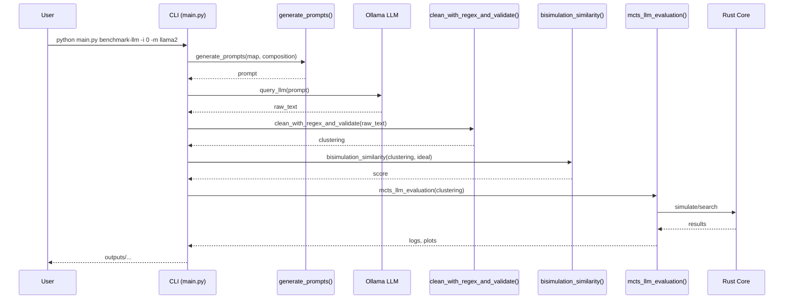

# Data Flow

A full run moves through several stages:

1. **Map generation** – parse maps from `config.yml` and render PNGs.
2. **Prompt assembly** – `llm.prompts.generate_prompts` composes text from fragments.
3. **LLM query** – `llm.ollama.query_llm` sends prompts to the local model; optional self‑refinement loops until a valid clustering is extracted.
4. **Parsing and validation** – `llm.clean.clean_with_regex_and_validate` normalises the response into clusters.
5. **Scoring** – `llm.scoring.bisimulation_similarity` compares candidate clusters to the ideal abstraction.
6. **Selection** – the best scoring abstraction is chosen.
7. **MCTS evaluation** – `evaluation.mcts_llm_evaluation` runs ground, ideal and LLM agents with different budgets and logs metrics.

Outputs (maps, JSON groupings, scores and plots) are written under `outputs/`.

