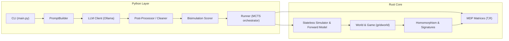

# System Architecture

Rust provides the performance‑critical core while Python orchestrates prompting, scoring and planning.

- **Rust core** (`src/core`)
  - `game` defines the `Game` and `State` types plus a fast stateless simulator.
  - `abstraction` exposes `get_all_states` and `compute_mdp_homomorphism` to build transition and reward matrices.
  - `runner` hosts the MCTS search used by Python.
- **Python layer** (`py/`)
  - `llm.prompts.generate_prompts` assembles prompts.
  - `llm.ollama.query_llm` queries local models.
  - `llm.clean` normalises responses and `llm.scoring.bisimulation_similarity` scores them.
  - `evaluation` modules run MCTS through the Rust extension.

