```mermaid
flowchart LR
  subgraph Python Layer
    CLI["CLI (main.py)"]
    PB["llm_abstraction.llm.prompts.generate_prompts"]
    LLM["llm_abstraction.llm.ollama.query_llm (Ollama)"]
    CLEAN["llm_abstraction.llm.clean.clean_with_regex_and_validate"]
    SCORE["llm_abstraction.llm.scoring.bisimulation_similarity"]
    RUN["llm_abstraction.evaluation.mcts.run_mcts / run_mcts_llm"]
  end
  subgraph Rust Core
    WORLD["core::game::game_logic::Game"]
    HOMO["core::abstraction::homomorphism::get_abstraction"]
    MATR["core::utils::matrices::build_matrices"]
    SIM["PyRunner (core::runner::Runner)"]
  end
  CLI --> PB --> LLM --> CLEAN --> SCORE
  SCORE --> RUN
  RUN --> SIM
  SIM --> WORLD
  RUN --> MATR
  HOMO --> MATR
  WORLD --> HOMO
```

# Architecture

The repository separates concerns between a fast Rust core and a flexible Python orchestration layer. Python assembles prompts, communicates with local models, cleans and validates outputs, and runs evaluation pipelines. Rust provides the deterministic environment, ideal abstractions, and a simulator that can execute either in the ground MDP or over an abstract state space. This separation keeps experiments both reproducible and quick while making it easy to iterate on prompts and analysis in Python.

At a glance, the Python layer contains the prompt builder, the LLM client and post‑processor, the bisimulation‑style scorer, and the MCTS runners and analysis tools. The Rust core implements the gridworld, homomorphism routines for ideal abstractions, utilities to build transition and reward matrices, and the stateless simulator exposed to Python via `pyo3`. The short overview below names the most relevant modules on each side; the component diagram in Figure 1 illustrates how they connect.

Overview
- Rust core (`src/core`). The `game` module defines `Game` and a fast stateless simulator; `abstraction` exposes `get_all_states` and `get_abstraction` to support matrix construction; `runner` hosts MCTS search that Python calls through `PyRunner`.
- Python layer (`llm_abstraction/`). `llm.prompts.generate_prompts` assembles prompts; `llm.ollama.query_llm` queries local models; `llm.clean` normalises responses; `llm.scoring.bisimulation_similarity` compares clusterings; `evaluation` modules run MCTS via the Rust extension.

Key entry points
- CLI: `main.py` defines subcommands.
- Prompt builder: `llm_abstraction.llm.prompts.generate_prompts`.
- LLM client: `llm_abstraction.llm.ollama.query_llm` (wraps `ollama.chat`).
- Cleaner: `llm_abstraction.llm.clean.clean_with_regex_and_validate`.
- Scorer: `llm_abstraction.llm.scoring.bisimulation_similarity`.
- Runners: `llm_abstraction.evaluation.mcts.run_mcts`, `run_mcts_llm`.
- Rust bindings: `core_rust` module in `src/lib.rs` (e.g., `PyRunner`, `generate_mdp`).

Figure 1: Component diagram of the Python and Rust layers. Arrows indicate the main control and data flow between modules.

The Python layer also uses `core_rust.generate_mdp` for `T` and `R` and for the ideal abstraction, and it calls `visualize_world_map` and `visualize_abstraction` to generate artifacts under `outputs/`.
