# Architecture

- Python layer: prompt builder, LLM client + cleaning, scoring, and runners/CLI.
- Rust core: gridworld, abstraction (homomorphism), matrices, and a stateless simulator exposed to Python.
- Responsibilities: MCTS runs in Python but delegates simulation/MDP ops to Rust; mapping between abstract ↔ ground is handled in Rust.

Overview (migrated)
- Rust core (`src/core`): `game` defines `Game` and a fast stateless simulator; `abstraction` exposes `get_all_states` and `get_abstraction` to support matrices; `runner` hosts MCTS search used via Python bindings.
- Python layer (`llm_abstraction/`): `llm.prompts.generate_prompts` assembles prompts; `llm.ollama.query_llm` queries local models; `llm.clean` normalises responses; `llm.scoring.bisimulation_similarity` scores them; `evaluation` modules run MCTS through the Rust extension.

Key entry points (read code):
- CLI: `main.py`
- Prompt builder: `llm_abstraction.llm.prompts.generate_prompts`
- LLM client: `llm_abstraction.llm.ollama.query_llm` (wraps `ollama.chat`)
- Cleaner: `llm_abstraction.llm.clean.clean_with_regex_and_validate`
- Scorer: `llm_abstraction.llm.scoring.bisimulation_similarity`
- Runners: `llm_abstraction.evaluation.mcts.run_mcts`, `run_mcts_llm`
- Rust bindings: `core_rust` module in `src/lib.rs` (e.g., `PyRunner`, `generate_mdp`)

```mermaid
flowchart LR
  subgraph Python Layer
    CLI["CLI (main.py)"]
    PB["llm_abstraction.llm.prompts.generate_prompts"]
    LLM["llm_abstraction.llm.ollama.query_llm (Ollama)"]
    CLEAN["llm_abstraction.llm.clean.clean_with_regex_and_validate"]
    SCORE["llm_abstraction.llm.scoring.bisimulation_similarity"]
    RUN["llm_abstraction.evaluation.mcts.run_mcts / run_mcts_llm"]
  end
  subgraph Rust Core
    WORLD["core::game::game_logic::Game"]
    HOMO["core::abstraction::homomorphism::get_abstraction"]
    MATR["core::utils::matrices::build_matrices"]
    SIM["PyRunner (core::runner::Runner)"]
  end
  CLI --> PB --> LLM --> CLEAN --> SCORE
  SCORE --> RUN
  RUN --> SIM
  SIM --> WORLD
  RUN --> MATR
  HOMO --> MATR
  WORLD --> HOMO
```

The Python layer also uses `core_rust.generate_mdp` for `T`,`R`, and the ideal abstraction, plus `visualize_world_map`/`visualize_abstraction` for artifacts under `outputs/`.
