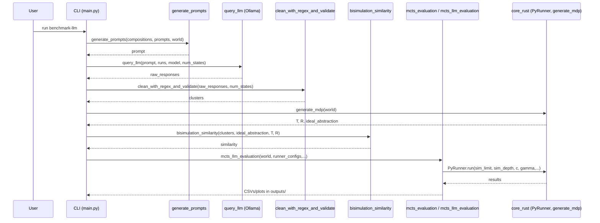

# Data Flow

- End-to-end: map generation → prompt assembly → LLM query → self‑refine/clean → model‑based score → select best → run agents → write outputs.
- Primary functions and modules are taken from the repository (read code references).

Stages (migrated)
1. Map generation: parse maps from `config.yml` and render PNGs.
2. Prompt assembly: `llm.prompts.generate_prompts` composes text from fragments.
3. LLM query: `llm.ollama.query_llm` collects valid responses with reprompting.
4. Parsing and validation: `llm.clean.clean_with_regex_and_validate` normalises to clusters.
5. Scoring: `llm.scoring.bisimulation_similarity` vs ideal abstraction from `core_rust.generate_mdp`.
6. Selection: choose the best scoring abstraction.
7. MCTS evaluation: `evaluation.mcts_llm_evaluation` runs ground/ideal/LLM agents and logs metrics.

