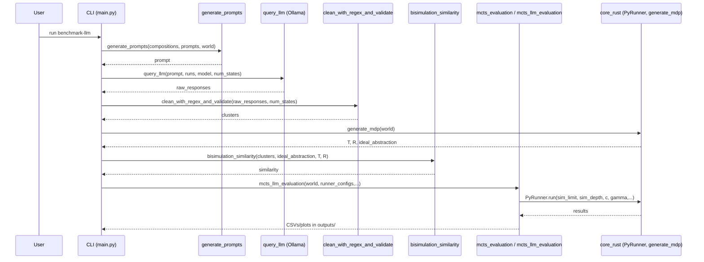

# Data Flow

This page walks through the end‑to‑end pipeline from maps to outputs and points to the functions that implement each stage. Figure 2 provides a sequence diagram of the interactions between components in a typical `benchmark-llm` run.

Stages
1. Map generation. We parse maps from `config.yml` and render PNGs for quick inspection.
2. Prompt assembly. `llm.prompts.generate_prompts` composes the instruction, contexts, representation, and output into a single prompt, inserting a JSON or text representation created by `core_rust.generate_representations_py`.
3. LLM query. `llm.ollama.query_llm` calls the local model through Ollama, performs rejection sampling, and reprompts to extract JSON‑only clusterings.
4. Parsing and validation. `llm.clean.clean_with_regex_and_validate` converts responses into cluster lists, validates coverage, and deduplicates states.
5. Scoring. We compute `llm.scoring.bisimulation_similarity` against the ideal abstraction from `core_rust.generate_mdp`, using `T` and `R` matrices.
6. Selection. We choose the best‑scoring abstraction for each map.
7. MCTS evaluation. `evaluation.mcts_llm_evaluation` runs ground, ideal, and LLM‑abstraction agents across a grid of budgets and depths and writes results to `outputs/`.

Figure 2: Sequence diagram of the `benchmark-llm` command from prompt generation through MCTS evaluation and artifact writing.
